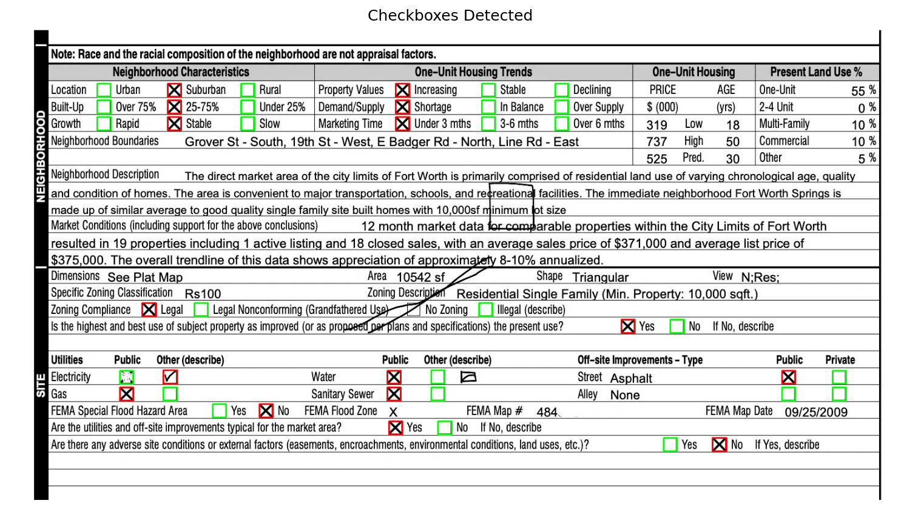
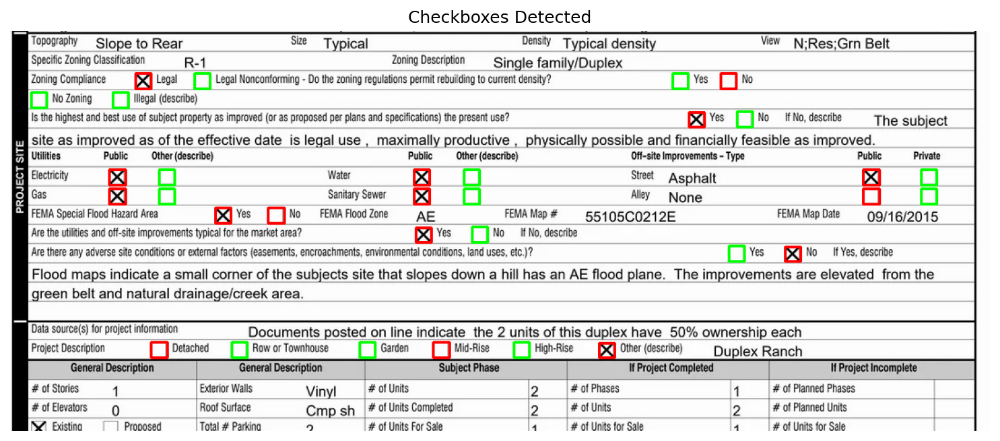
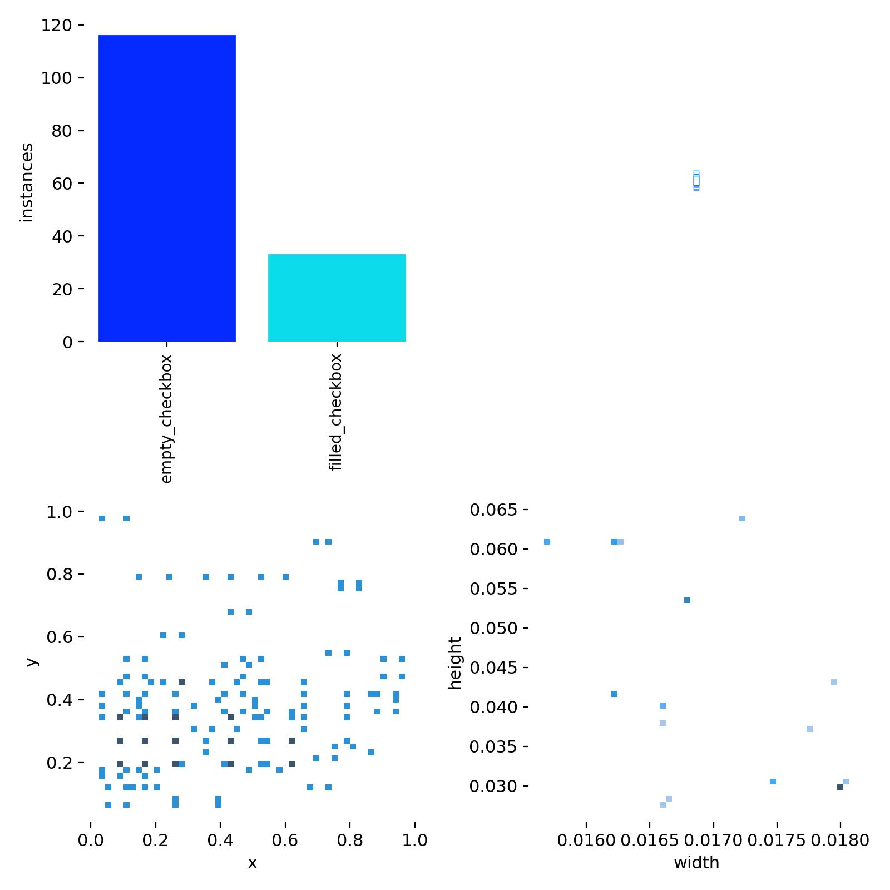
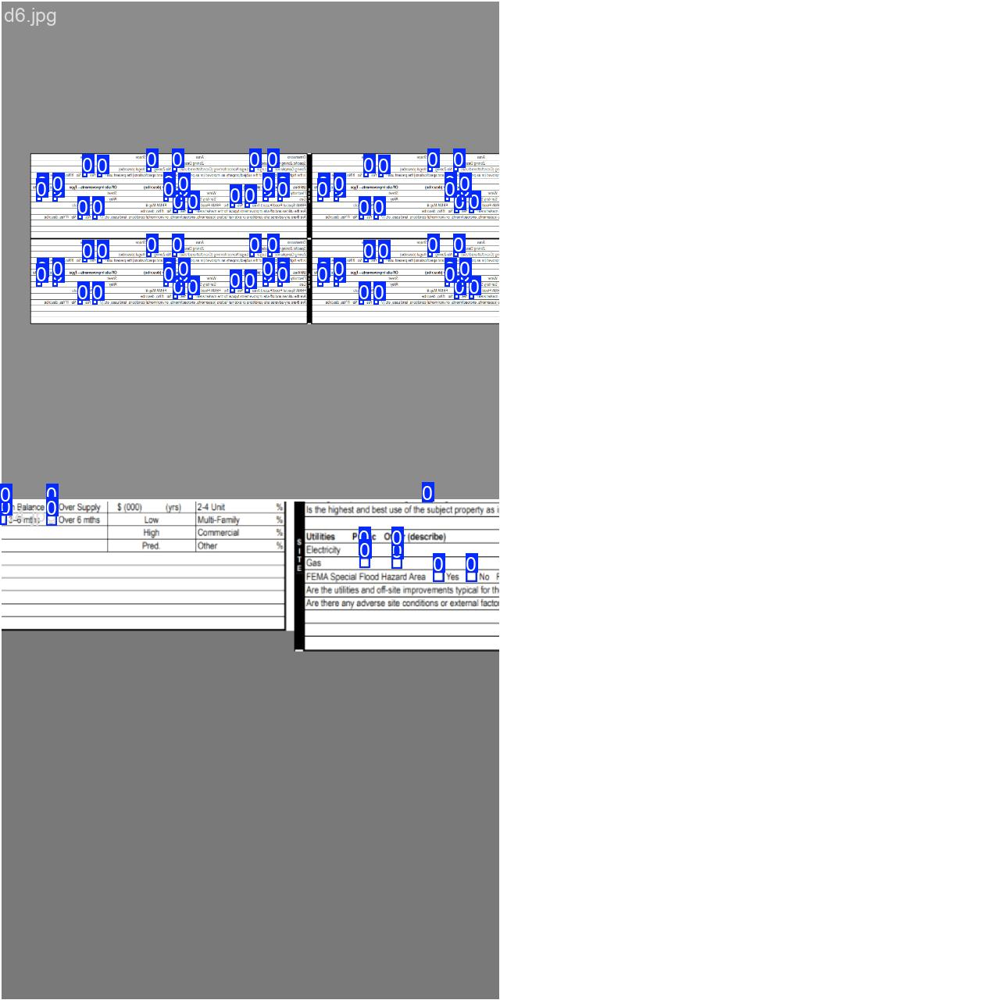
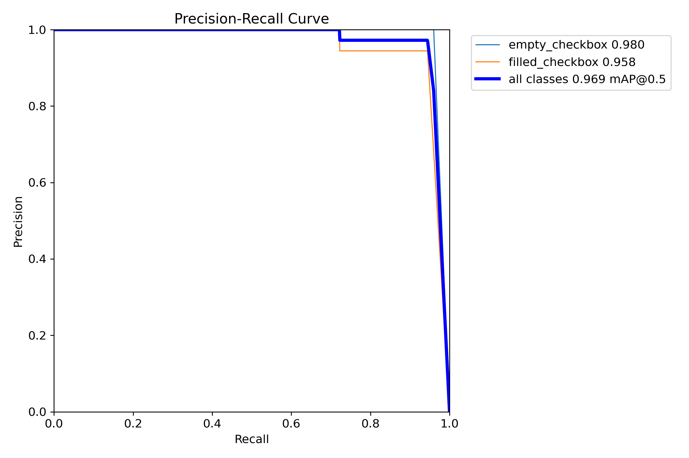
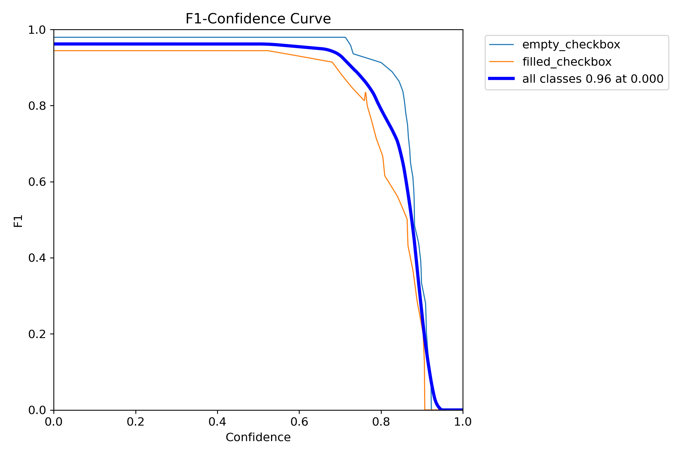
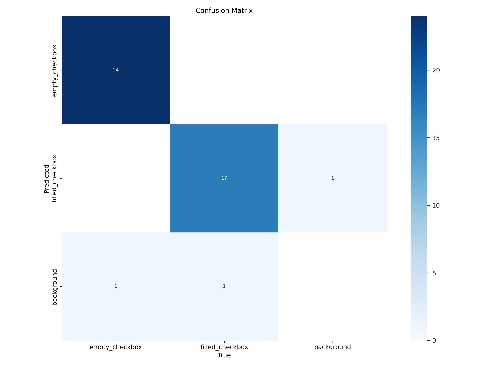
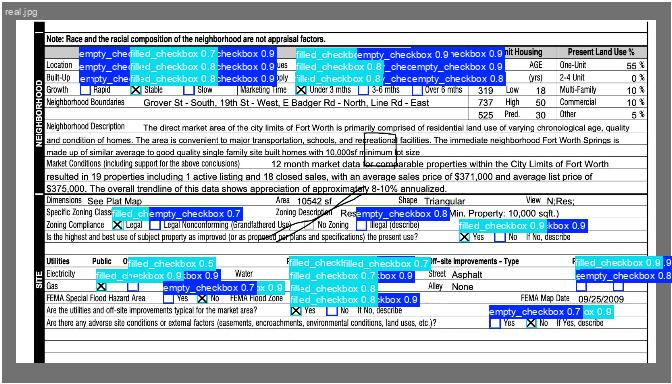
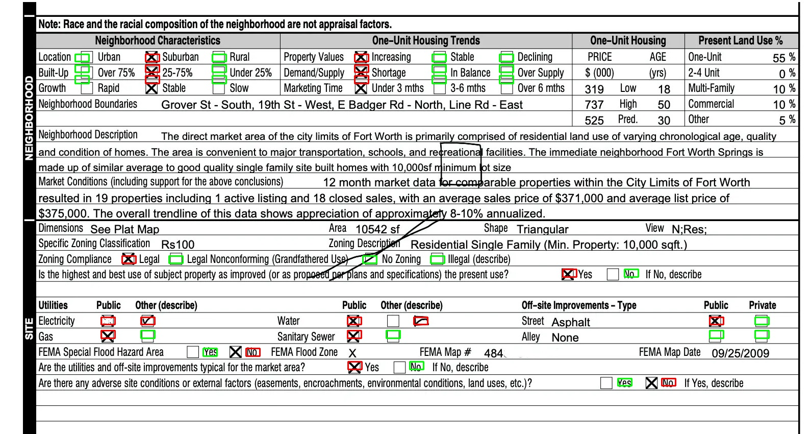

# Checkbox Detection: OpenCV vs YOLO vs Gemini

This repository compares **three approaches** to detecting and classifying checkboxes in scanned documents:

1. **OpenCV** (`checkbox_detector_opencv/`) — Traditional computer vision using contour detection and heuristics
2. **YOLOv11** (`checkbox_detector_yolo/`) — Deep learning object detection with transfer learning
3. **Gemini** (`checkbox_detector_gemini/`) — Vision LLM zero-shot prompting (no training required)

For a detailed explanation of the architecture, see [ARCHITECTURE.md](ARCHITECTURE.md).

## Quick Start

### OpenCV Approach

```bash
cd checkbox_detector_opencv
pip install -e .
python scripts/run_detector.py data/images/d1.jpg
```

The OpenCV detector will display the results with detected checkboxes highlighted. To save the output as an image:

```bash
python scripts/save_detection_output.py data/images/d1.jpg --output output.png
```

### YOLOv11 Approach

**Option 1: Command-line inference**
```bash
cd checkbox_detector_yolo
pip install -r requirements.txt
python test_inference.py input.jpg output.jpg
```

**Option 2: Docker API (Recommended for production)**
```bash
cd checkbox_detector_yolo
docker-compose up -d
# API available at http://localhost:8000
# See checkbox_detector_yolo/README.md for API usage details
```

**Option 3: Jupyter Notebook**
```bash
cd checkbox_detector_yolo
pip install -r requirements.txt
jupyter notebook notebooks/inference.ipynb
```

**Training from scratch:**
```bash
jupyter notebook notebooks/train_and_visualize_prototype.ipynb
```

### Gemini Approach (Zero-shot LLM)

```bash
cd checkbox_detector_gemini
pip install -r requirements.txt
python detect_checkboxes.py ../data/val/images/real.jpg --output detected.jpg
```

Requires a Gemini API key in `.env` file at repository root:
```bash
GEMINI_API_KEY=your_api_key_here
```

## Project Structure

```
checkbox_detector/
├── data/                         # Shared dataset (train/val)
│   ├── train/                    # Training images and labels
│   └── val/                      # Validation images and labels
│
├── checkbox_detector_opencv/     # Approach 1: Traditional CV
│   ├── checkbox_detector/        # Package source code
│   ├── scripts/                  # Example scripts
│   ├── tests/                    # Unit tests
│   └── data/                     # Sample images
│
├── checkbox_detector_yolo/       # Approach 2: Deep Learning
│   ├── runs/                     # Training outputs (gitignored)
│   ├── notebooks/                # Jupyter notebooks
│   ├── api.py                    # FastAPI REST API
│   ├── test_inference.py         # Command-line inference script
│   ├── docker-compose.yml        # Docker Compose configuration
│   ├── Dockerfile                # Docker container definition
│   └── requirements.txt          # Python dependencies
│
├── checkbox_detector_gemini/     # Approach 3: Vision LLM
│   ├── detect_checkboxes.py      # Main detection script
│   └── requirements.txt          # Python dependencies
│
├── docs/                         # Documentation images
├── ARCHITECTURE.md               # Architecture documentation
└── README.md                     # This file
```

## Results

All three approaches successfully detect checkboxes, but with different tradeoffs:

- **OpenCV**: Fast, interpretable, but requires extensive parameter tuning and struggles with layout variations
- **YOLOv11**: Generalizes well, minimal tuning needed, but requires labeled training data
- **Gemini**: Zero training required, but has API costs and higher latency

### OpenCV Detection Examples

The OpenCV approach uses contour detection and heuristics to identify checkboxes. Green boxes indicate unfilled checkboxes, red boxes indicate filled checkboxes.


*Example detection on document d1.jpg - Detected 16 filled and 25 unfilled checkboxes*


*Example detection on document d2.jpg - Detected 16 filled and 16 unfilled checkboxes*


*Original demo output showing checkbox detection results*

### YOLOv11 Training Results

The YOLOv11 model was trained on just 5 annotated images and achieves good generalization through transfer learning.

#### Dataset Overview


*Visualization of the training dataset showing annotated checkboxes (empty_checkbox in blue, filled_checkbox in red)*


*Sample training batch showing how the model learns from annotated examples*

#### Training Metrics


*Training metrics showing model performance over epochs (loss, mAP, precision, recall)*


*Precision-Recall curve showing the tradeoff between precision and recall for both classes*


*F1 score curve across different confidence thresholds for optimal performance*


*Confusion matrix showing classification accuracy for filled vs unfilled checkboxes*

#### Validation Results


*Validation batch predictions showing detected checkboxes with confidence scores*

### Gemini Detection Results

The Gemini approach uses zero-shot prompting with Google's Gemini vision models. No training required. We evaluated both Gemini 2.5 Pro and Gemini 3.0 Pro.


*Gemini 2.5 Pro detection results - Green boxes: empty checkboxes (24), Red boxes: filled checkboxes (18)*

## Comprehensive Evaluation Results

We evaluated all four methods on a validation set of 8 images containing 176 checkboxes total. The evaluation uses multiple metrics to assess both detection completeness (finding checkboxes) and localization precision (accurate bounding boxes).

### Main Metrics

| Method | GT | Pred | **R@0.3** | **P@0.3** | **mAP@50** (VOC) | **AP@75** | **mAP@50-95** (COCO) |
|--------|----|------|-----------|-----------|------------------|-----------|----------------------|
| **Gemini 3.0 Pro** | 176 | 175 | **0.994** | **1.000** | **0.944** | **0.089** | **0.350** |
| **Gemini 2.5 Pro** | 176 | 176 | 0.869 | 0.869 | 0.570 | 0.003 | 0.126 |
| **YOLOv11** | 176 | 202 | 0.824 | 0.718 | 0.681 | 0.041 | 0.236 |
| **OpenCV** | 176 | 101 | 0.386 | 0.673 | 0.408 | 0.083 | 0.210 |

**Metric Definitions:**
- **R@0.3 / P@0.3**: Recall and Precision at IoU threshold 0.3 (lenient, measures detection completeness)
- **mAP@50**: Mean Average Precision at IoU 0.50 (VOC standard, balances detection and localization)
- **AP@75**: Average Precision at IoU 0.75 (strict, measures precise localization)
- **mAP@50-95**: Mean Average Precision averaged across IoU 0.50-0.95 (COCO standard, holistic quality)

### Detailed Metrics

| Method | F1@25 | F1@35 | F1@50 | F1@75 | P@50 | R@50 | P@75 | R@75 |
|--------|-------|-------|-------|-------|------|------|------|------|
| **Gemini 3.0 Pro** | **0.997** | **0.997** | **0.980** | **0.307** | **0.983** | **0.977** | **0.308** | **0.307** |
| **Gemini 2.5 Pro** | 0.915 | 0.841 | 0.670 | 0.051 | 0.670 | 0.670 | 0.051 | 0.051 |
| **YOLOv11** | 0.767 | 0.767 | 0.767 | 0.209 | 0.731 | 0.818 | 0.203 | 0.216 |
| **OpenCV** | 0.570 | 0.491 | 0.407 | 0.257 | 0.592 | 0.330 | 0.403 | 0.193 |

### Key Findings

1. **Gemini 3.0 Pro achieves near-perfect performance**: 99.4% recall and 100% precision at IoU=0.3, with 94.4% mAP@50. This represents a significant improvement over Gemini 2.5 Pro.

2. **Detection vs. Localization**: All methods show a drop-off from lenient to strict IoU thresholds, indicating that finding checkboxes is easier than precisely localizing them. Ground truth boxes were shrunk by 15% to better align with model predictions.

3. **YOLOv11 shows consistent performance** across thresholds but generates more false positives (202 predictions vs. 176 ground truth).

4. **OpenCV has high precision but very low recall** (38.6% R@0.3), missing most checkboxes entirely.

### Comparison Summary

| Feature | OpenCV | YOLOv11 | Gemini 2.5 Pro | Gemini 3.0 Pro |
|---------|--------|---------|----------------|----------------|
| **Speed** | ~10ms | ~250ms | ~3s | ~3s |
| **Training Data** | None | Required | None | None |
| **GPU Required** | No | Optional | No (API) | No (API) |
| **Parameter Tuning** | Extensive | Minimal | Prompt engineering | Prompt engineering |
| **Generalization** | Limited | Excellent | Good | Excellent |
| **Cost** | Free | Free | ~$0.02/image | ~$0.02/image |
| **Best Use Case** | Interpretability | Production deployment | Zero-shot prototyping | Zero-shot production |

For detailed explanation of the metrics and methodology, see [BLOG_METRICS.md](BLOG_METRICS.md).

### Running Evaluation

To reproduce these results or evaluate on your own data:

```bash
# Generate predictions for all methods
python checkbox_detector_gemini/predict.py --input data/val/images --output predictions/gemini --model gemini-2.5-pro
python checkbox_detector_gemini/predict.py --input data/val/images --output predictions/gemini30 --model gemini-3-pro-preview
python checkbox_detector_yolo/predict.py --input data/val/images --output predictions/yolo
python checkbox_detector_opencv/predict.py --input data/val/images --output predictions/opencv

# Run evaluation
python evaluate.py predictions/gemini predictions/gemini30 predictions/yolo predictions/opencv \
    --visualize --save-json evaluation_results.json
```

## Evaluation

The repository includes a comprehensive evaluation framework (`evaluate.py`) that compares all methods using standard object detection metrics:

- **Recall@0.3** and **Precision@0.3**: Detection completeness at lenient IoU threshold
- **mAP@0.50** (VOC-style): Standard localization quality metric
- **AP@0.75**: Strict localization precision
- **mAP@0.50-0.95** (COCO AP): Holistic quality across all IoU thresholds

The evaluation script uses the [`supervision`](https://github.com/roboflow/supervision) library for standardized metric calculation and supports visualization of predictions.

See [BLOG_METRICS.md](BLOG_METRICS.md) for detailed explanation of each metric and interpretation of results.

## Testing

### OpenCV Solution

The OpenCV implementation includes comprehensive unit tests. Run the test suite:

```bash
cd checkbox_detector_opencv
python -m pytest tests/test_checkbox_detector.py -v
```

All tests pass successfully, verifying:
- ✅ Detection of filled checkboxes
- ✅ Detection of unfilled checkboxes  
- ✅ Classification accuracy
- ✅ Bounding box accuracy
- ✅ Handling of edge cases (text without checkboxes)

**Verified Working**: The detector successfully processes test images and correctly identifies checkboxes. For example, on `d1.jpg` it detects 16 filled and 25 unfilled checkboxes.

### YOLOv11 Solution

The YOLOv11 model has been trained and validated. See the training notebooks for detailed evaluation metrics and inference examples.

## Requirements

### OpenCV
- Python 3.7+
- opencv-python
- numpy
- matplotlib

### YOLOv11
- Python 3.9+
- PyTorch (with CUDA for training)
- ultralytics
- matplotlib
- opencv-python

### Gemini
- Python 3.9+
- google-genai
- opencv-python
- python-dotenv

## Deployment

The YOLOv11 implementation includes a production-ready FastAPI service that can be deployed using Docker. See the [YOLO README](checkbox_detector_yolo/README.md#deployment) for detailed deployment instructions and API usage examples.

## Architecture Highlights

- **Three Implementation Approaches**: Traditional CV (OpenCV) vs Deep Learning (YOLO) vs Vision LLM (Gemini)
- **Production-Ready API**: FastAPI REST endpoint with Docker support for YOLO
- **Comprehensive Testing**: Unit tests for OpenCV implementation
- **CI/CD**: GitHub Actions workflow for automated testing
- **Well-Documented**: Detailed READMEs, architecture docs, and API documentation

See [ARCHITECTURE.md](ARCHITECTURE.md) for detailed explanation of folder structure, Docker setup, and GPU requirements.

## License

MIT

