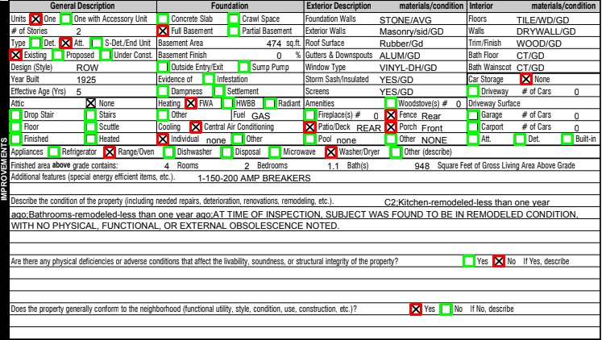

# Checkbox Detection: OpenCV vs YOLO vs Gemini

This repository compares **three approaches** to detecting and classifying checkboxes in scanned documents:

1. **OpenCV** (`checkbox_detector_opencv/`) — Traditional computer vision using contour detection and heuristics
2. **YOLOv11** (`checkbox_detector_yolo/`) — **Custom-trained deep learning model** using transfer learning from COCO pretrained weights, deployed as a production-ready Docker + FastAPI service
3. **Gemini** (`checkbox_detector_gemini/`) — Vision LLM zero-shot prompting (no training required)



## Results

| Method | R@0.3 | P@0.3 | mAP@50 | AP@75 | mAP@50-95 | Latency |
|--------|-------|-------|--------|-------|-----------|---------|
| **Gemini 3.0 Pro** | **0.994** | **1.000** | **0.944** | **0.089** | **0.350** | ~6s |
| **Gemini 2.5 Pro** | 0.869 | 0.869 | 0.570 | 0.003 | 0.126 | ~6s |
| **YOLOv11 (Custom-Trained)** | 0.824 | 0.718 | 0.681 | 0.041 | 0.236 | ~250ms |
| **OpenCV** | 0.386 | 0.673 | 0.408 | 0.083 | 0.210 | ~10ms |

**Metrics:**
- **R@0.3 / P@0.3**: Recall and Precision at IoU=0.3 — measures detection completeness (did we find the checkboxes at all, even if slightly mishapen?)
- **mAP@50**: Mean Average Precision at IoU=0.50 (VOC standard) — balances detection and localization quality
- **AP@75**: Average Precision at IoU=0.75 — strict localization, requires precise bounding boxes
- **mAP@50-95**: Mean AP averaged across IoU 0.50-0.95 (COCO standard) — holistic quality metric

### Gemini

Gemini 3.0 Pro achieves near-perfect detection (99.4% recall, 100% precision) with zero training data required. The dramatic improvement over 2.5 Pro shows rapid progress in vision LLM spatial understanding. Main tradeoff is latency (~6s per image).

### YOLOv11: Custom-Trained Production Model

**Custom Model Training & Deployment**

This solution features a **fully custom-trained YOLOv11 model** that I personally annotated and trained from scratch using transfer learning. Starting from pretrained COCO weights, the model was fine-tuned on a carefully annotated dataset to specialize in checkbox detection and classification (filled vs. unfilled).

**Key Highlights:**
- **Custom Dataset Annotation**: Manually annotated training data with precise bounding boxes and class labels
- **Transfer Learning**: Leveraged pretrained COCO weights for robust feature extraction, achieving strong generalization with minimal training data (just 5 annotated images)
- **Production Deployment**: Containerized with Docker and exposed via FastAPI REST API for scalable, production-ready inference
- **Performance**: Achieves 82.4% recall and 71.8% precision with sub-250ms latency—ideal for production deployments requiring low latency and zero per-request costs

The model demonstrates excellent generalization capabilities, maintaining consistent performance across IoU thresholds while providing the speed and reliability needed for real-world document processing pipelines.


### OpenCV

The heuristic-based approach is fast and interpretable but conservative—when it detects a checkbox, it's usually correct (67% precision), but it misses most checkboxes (39% recall). Requires extensive parameter tuning for different document layouts.

## Quick Start

### OpenCV Approach

```bash
cd checkbox_detector_opencv
pip install -e .
python scripts/run_detector.py data/images/d1.jpg
```

### YOLOv11 Approach (Custom-Trained Model)

**Production Deployment with Docker + FastAPI (Recommended):**

The model is deployed as a containerized FastAPI service for production use:

```bash
cd checkbox_detector_yolo
docker-compose up -d
# API available at http://localhost:8000
# Interactive docs at http://localhost:8000/docs
```

**Command-line inference:**
```bash
cd checkbox_detector_yolo
pip install -r requirements.txt
python test_inference.py input.jpg output.jpg
```

**Training the model:**
```bash
# See notebooks/train_and_visualize_prototype.ipynb for full training pipeline
# Model weights saved to runs/detect/train/weights/best.pt
```

### Gemini Approach

```bash
cd checkbox_detector_gemini
pip install -r requirements.txt
python detect_checkboxes.py ../data/val/images/real.jpg --output detected.jpg
```

Requires a Gemini API key in `.env` file at repository root:
```bash
GEMINI_API_KEY=your_api_key_here
```

## Project Structure

```
checkbox_detector/
├── data/                         # Shared dataset (train/val)
│   ├── train/                    # Training images and labels
│   └── val/                      # Validation images and labels
│
├── checkbox_detector_opencv/     # Approach 1: Traditional CV
│   ├── checkbox_detector/        # Package source code
│   ├── scripts/                  # Example scripts
│   └── tests/                    # Unit tests
│
├── checkbox_detector_yolo/       # Approach 2: Custom-Trained YOLOv11 Model
│   ├── runs/                     # Training outputs & model weights
│   ├── notebooks/                # Training & inference notebooks
│   ├── api.py                    # FastAPI REST API service
│   ├── Dockerfile                # Production Docker container
│   └── docker-compose.yml        # Docker Compose orchestration
│
├── checkbox_detector_gemini/     # Approach 3: Vision LLM
│   ├── detect_checkboxes.py      # Main detection script
│   └── predict.py                # Batch prediction
│
├── evaluate.py                   # Method-agnostic evaluator
└── evaluation_output/            # Visualization outputs
```

## Running Evaluation

To reproduce results or evaluate on your own data:

```bash
# Generate predictions for all methods
python checkbox_detector_gemini/predict.py --input data/val/images --output predictions/gemini --model gemini-2.5-pro
python checkbox_detector_gemini/predict.py --input data/val/images --output predictions/gemini30 --model gemini-3-pro-preview
python checkbox_detector_yolo/predict.py --input data/val/images --output predictions/yolo
python checkbox_detector_opencv/predict.py --input data/val/images --output predictions/opencv

# Run evaluation
python evaluate.py predictions/gemini predictions/gemini30 predictions/yolo predictions/opencv \
    --visualize --save-json evaluation_results.json
```

## Requirements

### OpenCV
- Python 3.7+
- opencv-python, numpy, matplotlib

### YOLOv11
- Python 3.9+
- PyTorch (CUDA optional), ultralytics

### Gemini
- Python 3.9+
- google-genai, opencv-python, python-dotenv

## License

MIT
