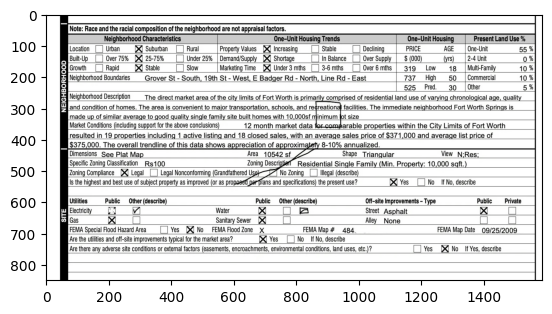
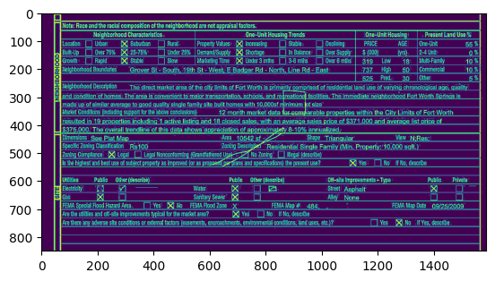
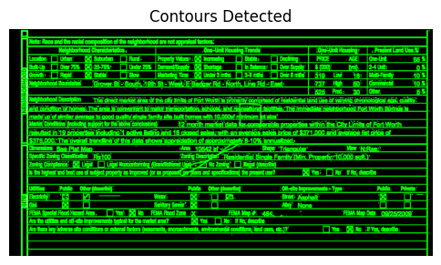
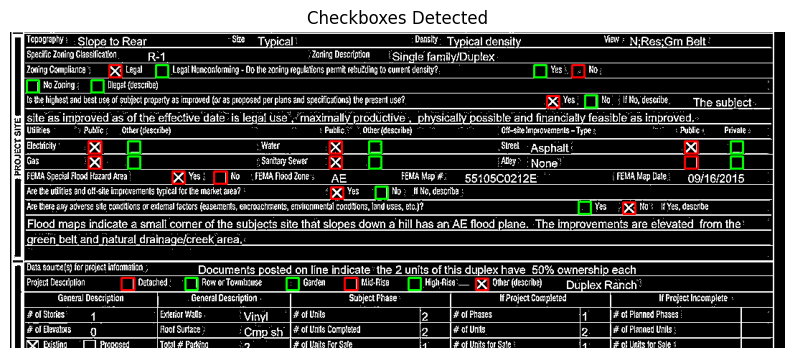

# Checkbox Detection using OpenCV

This repository contains a Python package for detecting and classifying checkboxes in scanned documents using traditional computer vision techniques. The approach uses contour detection, geometric heuristics, and intensity-based classification—no machine learning required.

## Installation

```bash
cd checkbox_detector_opencv
pip install -e .
```

## Step-by-Step Pipeline



### 1. Preprocessing

Convert to grayscale and apply adaptive thresholding to create a binary image.



### 2. Detection

Find square-like contours using aspect ratio and convex hull filtering.



### 3. Classification

Classify checkboxes as filled or empty based on mean intensity of the region.



## Unit Testing

The package includes comprehensive unit tests using small, focused test images. All tests are located in `tests/test_checkbox_detector.py`.

### Test Images

The test suite uses 5 carefully crafted test images in `tests/test_data/`:

1. **`filled_checkbox.jpg`** - Single filled checkbox
2. **`unfilled_checkbox.jpg`** - Single empty checkbox  
3. **`filled_and_unfilled_checkbox.jpg`** - Both types in one image
4. **`filled_checkbox_fuzzy.jpg`** - Filled checkbox with noise/blur
5. **`text_without_checkboxes.jpg`** - Text-only image (negative test case)

### Test Coverage

The test suite validates:

- ✅ **Detection accuracy**: Correct number of checkboxes detected
- ✅ **Bounding box dimensions**: Width and height in expected range (20-50 pixels)
- ✅ **Classification accuracy**: Correctly identifies filled vs. unfilled
- ✅ **Edge cases**: No false positives on text-only images

**Run tests**:
```bash
cd checkbox_detector_opencv
python -m pytest tests/test_checkbox_detector.py -v
```

All tests pass successfully, verifying the detector works correctly on isolated checkbox images.

## Usage

### Basic Usage

```bash
python scripts/run_detector.py data/images/d1.jpg
```

### Debug Mode

Visualize intermediate steps:

```bash
# Show preprocessed image and all contours
python scripts/run_detector.py data/images/d1.jpg --debug

# Show individual contours (useful for small images)
python scripts/run_detector.py data/images/d1.jpg --debug_individual_contours
```

### Programmatic Usage

```python
from checkbox_detector import preprocess_image, detect_checkboxes, classify_checkboxes, display_detections
import cv2

# Load and preprocess
morph = preprocess_image("data/images/d1.jpg")

# Detect checkboxes
checkboxes = detect_checkboxes(morph)

# Classify as filled/unfilled
filled, unfilled = classify_checkboxes(morph, checkboxes)

# Visualize results
image = cv2.imread("data/images/d1.jpg", cv2.IMREAD_GRAYSCALE)
display_detections(image, filled, unfilled)
```

## Limitations

- **Layout sensitivity**: Struggles with complex layouts or non-standard checkbox designs (e.g., "No Zoning" checkboxes that require semantic understanding)
- **Generalization**: Requires parameter tuning for different document types and layouts
- **Recall**: Conservative approach means high precision but lower recall (misses some checkboxes)

For better generalization, consider the YOLO or Gemini approaches in the parent repository.

## Directory Structure
