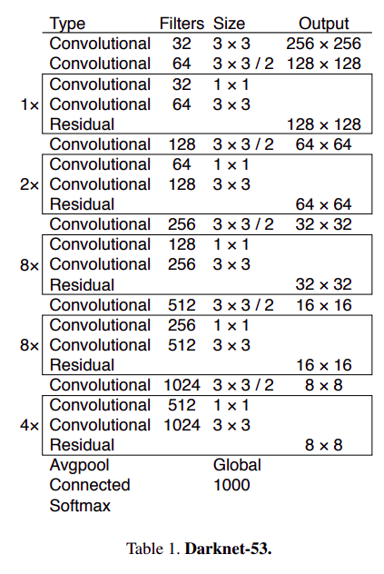

# Checkbox Detection using YOLOv11

This repository contains a YOLOv11-based object detection model for detecting and classifying checkboxes (filled vs. unfilled) in scanned documents.


## Why YOLO?

YOLO (You Only Look Once) was chosen for this checkbox detection task for several key reasons:

### Speed and Real-time Performance
YOLO processes entire images in a single forward pass, making it significantly faster than two-stage detectors (like R-CNN variants). This is crucial for document processing pipelines where speed matters.

### End-to-End Detection and Classification
Unlike traditional computer vision approaches that require separate steps for detection and classification, YOLO can simultaneously:
- Detect checkbox locations (bounding boxes)
- Classify them as filled or unfilled
- All in a single neural network pass

### Transfer Learning Benefits
YOLOv11 comes with pretrained weights on large-scale datasets (COCO), allowing us to achieve good results with minimal training data. Our model was trained on just **5 annotated images** yet generalizes well thanks to transfer learning.



### Model Variants and Flexibility
YOLO offers multiple model sizes (nano, small, medium, large, xlarge) allowing us to balance accuracy and inference speed based on deployment requirements. The YOLOv11n (nano) variant used here provides excellent performance with minimal computational overhead.


### Production Ready
The Ultralytics YOLO implementation provides:
- Easy-to-use Python API
- Docker containerization support
- REST API integration (FastAPI)
- Cross-platform compatibility (CPU/GPU)

This makes YOLO ideal for both development and production deployment scenarios.

## Quick Start

### Inference

You can run inference using multiple methods:

**Option 1: Docker API (Recommended for production)**

```bash
# From this directory (checkbox_detector_yolo/)
docker-compose up -d

# Test the API
curl http://localhost:8000/health

# Use the API (see API Usage section below)
```

**Option 2: Command-line script**

```bash
python test_inference.py input_image.jpg output_image.jpg
```

Options:
- `input_image`: Path to input image (required)
- `output_image`: Path to save annotated output image (optional)
- `--weights`: Path to model weights (default: `runs/detect/train/weights/best.pt`)
- `--conf`: Confidence threshold (default: 0.2)

**Option 3: Jupyter Notebook**

```bash
jupyter notebook notebooks/inference.ipynb
```

**Option 4: Python API directly**

```bash
pip install -r requirements.txt
python api.py
# API available at http://localhost:8000
```

The trained model weights are located at `runs/detect/train/weights/best.pt`.

### Training

To train the model from scratch or retrain:

```bash
jupyter notebook notebooks/train_and_visualize_prototype.ipynb
```

For results and discussion, see the main training notebook: `notebooks/train_and_visualize_prototype.ipynb`

# Set Up your environment

Create a conda environment

```bash
conda create -n yolov11-env python=3.9 -y
conda activate yolov11-env
```

Install / Update Pytorch as needed by following the [official instructions](https://pytorch.org/get-started/locally/), e.g:

```bash
pip install torch torchvision torchaudio --index-url https://download.pytorch.org/whl/cu121
```

Install other packages:

```bash
pip install -r requirements.txt
```

If you encounter problems installing ultralytics, refer to the [official instructions](https://docs.ultralytics.com/quickstart/).

## Project Structure

```
checkbox_detector_yolo/
├── notebooks/                    # Jupyter notebooks
│   ├── train_and_visualize_prototype.ipynb  # Main training notebook
│   ├── inference.ipynb           # Inference notebook
│   └── train_and_visualize_prototype.md     # Exported notebook
├── runs/                        # Training outputs (gitignored)
│   └── detect/
│       └── train/
│           └── weights/
│               └── best.pt      # Trained model weights
├── docs/                        # Documentation images
├── api.py                       # FastAPI REST API endpoint
├── test_inference.py            # Command-line inference script
├── docker-compose.yml           # Docker Compose configuration
├── Dockerfile                   # Docker container definition
├── data.yaml                    # Dataset configuration (points to ../data/)
└── requirements.txt             # Python dependencies

# Dataset is shared at repository root:
../data/
├── train/                       # Training images and labels
│   ├── images/
│   └── labels/
└── val/                         # Validation images and labels
    ├── images/
    └── labels/
```

## Dataset

The model was trained on just **5 annotated images** with two classes:
- `empty_checkbox` (class 0)
- `filled_checkbox` (class 1)

Despite the minimal dataset, the model achieves good generalization thanks to transfer learning from YOLOv11's pretrained weights.

# Troubleshooting

If your jupyter instance is finding trouble getting linked to the conda env, try:

```bash
conda install ipykernel
python -m ipykernel install --user --name=yolov11 --display-name "Python yolov11"
```

And then select kernel yolov11 when you run the notebooks.

## Deployment

### Why Docker?

YOLO uses Docker for several reasons:

1. **Reproducibility**: PyTorch + CUDA versions must match exactly. Docker freezes the environment.
2. **Deployment**: The FastAPI service can be deployed anywhere Docker runs.
3. **Isolation**: Doesn't pollute your system Python with ML libraries.
4. **GPU Support**: NVIDIA Container Toolkit enables GPU passthrough.

### Docker Files

```
checkbox_detector_yolo/
├── Dockerfile           # Builds the inference service image
└── docker-compose.yml   # Orchestrates the service
```

#### Dockerfile Overview

The Dockerfile creates a lightweight Python 3.9 image with:
- OpenCV system dependencies (`libgl1-mesa-glx`)
- Python dependencies from `requirements.txt`
- FastAPI application code
- Exposes port 8000 for the API

#### docker-compose.yml Overview

The compose file:
- Builds the service from the Dockerfile
- Maps port 8000 to host
- Mounts model weights as read-only volume
- Mounts dataset directory for access
- Includes health check endpoint

### Docker Compose (Recommended)

The easiest way to deploy the API service:

```bash
# From this directory (checkbox_detector_yolo/)
docker-compose up -d

# Check logs
docker-compose logs -f

# Check health
curl http://localhost:8000/health
# {"status":"healthy","model_loaded":true}

# Stop the service
docker-compose down
```

The API will be available at `http://localhost:8000`

### Building Docker Image Manually

```bash
docker build -t checkbox-detector:latest .
docker run -d \
  -p 8000:8000 \
  -v $(pwd)/runs/detect/train/weights:/app/runs/detect/train/weights:ro \
  --name checkbox-detector \
  checkbox-detector:latest
```

### Advantages of Containerization

| Advantage | Description |
|-----------|-------------|
| **Portability** | Runs on any machine with Docker (Linux, Mac, Windows WSL2) |
| **Reproducibility** | Same environment in dev, CI, and production |
| **Isolation** | No dependency conflicts with other projects |
| **Easy deployment** | Push to registry → `docker pull` → `docker run` |
| **Scalability** | Easy to scale horizontally with Kubernetes/Docker Swarm |

## API Usage

### Health Check

```bash
curl http://localhost:8000/health
```

### Predict Checkboxes (JSON Response)

```bash
curl -X POST "http://localhost:8000/predict?conf=0.2" \
  -H "accept: application/json" \
  -H "Content-Type: multipart/form-data" \
  -F "file=@path/to/image.jpg"
```

### Predict Checkboxes (Annotated Image)

```bash
curl -X POST "http://localhost:8000/predict/image?conf=0.2" \
  -H "accept: image/jpeg" \
  -H "Content-Type: multipart/form-data" \
  -F "file=@path/to/image.jpg" \
  --output detected_checkboxes.jpg
```

### Python Client Example

```python
import requests

# Predict checkboxes
with open('image.jpg', 'rb') as f:
    response = requests.post(
        'http://localhost:8000/predict',
        files={'file': f},
        params={'conf': 0.2}
    )
    results = response.json()
    print(f"Detected {results['total']} checkboxes")
    print(f"Empty: {results['counts']['empty_checkbox']}")
    print(f"Filled: {results['counts']['filled_checkbox']}")

# Get annotated image
with open('image.jpg', 'rb') as f:
    response = requests.post(
        'http://localhost:8000/predict/image',
        files={'file': f}
    )
    with open('output.jpg', 'wb') as out:
        out.write(response.content)
```

### Interactive API Documentation

Once the service is running, visit:
- `http://localhost:8000/docs` - Swagger UI
- `http://localhost:8000/redoc` - ReDoc

## Production Considerations

For production deployment, consider:

1. **Model Weights**: Use a model registry or object storage (S3, GCS) instead of mounting local files
2. **Scaling**: Use Kubernetes or Docker Swarm for horizontal scaling
3. **Monitoring**: Add Prometheus metrics and logging (e.g., ELK stack)
4. **Security**: 
   - Use HTTPS/TLS
   - Add authentication/authorization
   - Rate limiting
   - Input validation and file size limits
5. **Resource Limits**: Set appropriate CPU/memory limits in Docker
6. **Health Checks**: The container includes a health check endpoint

## How Weights Are Loaded

#### 1. Training Produces Weights

After training (in `notebooks/train_and_visualize_prototype.ipynb`), weights are saved:
```
runs/detect/train/weights/
├── best.pt    # Best checkpoint (lowest val loss)
└── last.pt    # Final epoch checkpoint
```

#### 2. Inference Loads Weights

**CLI Script (`test_inference.py`):**
```python
from ultralytics import YOLO

# Default path
model = YOLO("runs/detect/train/weights/best.pt")

# Or custom path via --weights flag
model = YOLO(args.weights)
```

**FastAPI (`api.py`):**
```python
MODEL_PATH = "runs/detect/train/weights/best.pt"

@app.on_event("startup")
async def load_model():
    global model
    model = YOLO(MODEL_PATH)  # Load once at startup
```

**Docker:**
Weights are mounted as a volume, so you can update them without rebuilding:
```yaml
volumes:
  - ./runs/detect/train/weights:/app/runs/detect/train/weights:ro
```

#### 3. Weight File Format

- **Format**: PyTorch checkpoint (`.pt`)
- **Size**: ~6MB (YOLOv11n backbone)
- **Contents**: Model architecture + trained parameters
- **Portability**: Works on any machine with `ultralytics` installed

## Troubleshooting

### Model Not Loading

If you see "Model not loaded" errors:
1. Verify model weights exist at `runs/detect/train/weights/best.pt`
2. Check Docker volume mounts are correct
3. Review container logs: `docker-compose logs`

### Port Already in Use

Change the port mapping in `docker-compose.yml`:
```yaml
ports:
  - "8001:8000"  # Use port 8001 instead
```

### GPU Support

#### Do You Need a GPU?

| Task | GPU Required? | Notes |
|------|---------------|-------|
| **Training** | ✅ Recommended | Training on CPU is extremely slow (hours vs minutes) |
| **Inference** | ❌ Optional | CPU inference works fine (~250ms per image) |
| **Docker API** | ❌ Optional | Falls back to CPU automatically |

#### GPU Inference (if available)

The YOLO library auto-detects CUDA:
```python
from ultralytics import YOLO
model = YOLO("best.pt")
# Automatically uses GPU if available, CPU otherwise
results = model.predict("image.jpg")
```

#### Force CPU

```python
results = model.predict("image.jpg", device="cpu")
```

#### GPU with Docker

For GPU acceleration, modify the Dockerfile to use `nvidia/cuda` base image and add GPU runtime flags to docker-compose.yml:

```yaml
# docker-compose.yml
services:
  checkbox-detector-api:
    runtime: nvidia
    environment:
      - NVIDIA_VISIBLE_DEVICES=all
```
