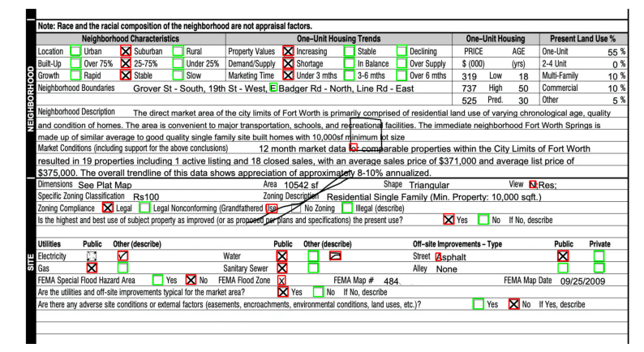

# Checkbox detection using YOLOv11

In this notebook, we prototype an object detection model to tackle the task of checkbox detection in documents.

## Why use machine learning?

Traditional approaches, like those using OpenCV, require extensive parameter tuning and threshold adjustments tailored to specific document templates. While these methods can work for narrowly defined formats, they often generalize poorly.

Learned approached potentially offer a more robust and adaptable solution. The hierarchical nature of CNNs makes them particularly effective at identifying structured patterns, like squares.

## Why use YOLO?
* Open source, easy to use off-the-shelf implementation.
* SotA family of models for object detection.
* Fast.

## Training data
I annotated a tiny sample of 5 documents similar to original challenge image. The images and the annotations are in the subfolder `datasets/checkboxes`. Here is an example:


## Validation data
A number of unseen samples will work as the validation set

# Training


```python
from ultralytics import YOLO
```


```python
# Load a model
model = YOLO("yolo11m.pt")  # load a pretrained model
# Train the model with 4 GPUs
results = model.train(data="data.yaml", 
                      epochs=100, 
                      imgsz=640, 
                      device=[0, 1, 2, 3],
                      conf=0.5) # Filter out low-confidence boxes
```

    New https://pypi.org/project/ultralytics/8.3.38 available 😃 Update with 'pip install -U ultralytics'
    Ultralytics 8.3.36 🚀 Python-3.9.20 torch-2.5.1+cu124 CUDA:0 (NVIDIA GeForce GTX 1080 Ti, 11172MiB)
                                                          CUDA:1 (NVIDIA GeForce GTX 1080 Ti, 11172MiB)
                                                          CUDA:2 (NVIDIA GeForce GTX 1080 Ti, 11172MiB)
                                                          CUDA:3 (NVIDIA GeForce GTX 1080 Ti, 11169MiB)
    Logging results to runs/detect/train
    Starting training for 100 epochs...
    (...)


# Results

Training succeeded! The training loss quickly dropped to very small values, which means the model has learned to fit the training dataset. The val loss is very close to the training lose, indicating good generalization.


# Validation on the challenge image
During training, the model has not seen the challenge image. Let's see what the predictions look like:


```python
import cv2
challenge_img_path = "datasets/checkboxes/val/images/real.jpg"
results = model.predict(challenge_img_path, save=True, device=[0], imgsz=640, conf=0.49)
```

    
    image 1/1 /home/jeremiasrodriguez/yolo/datasets/checkboxes/val/images/real.jpg: 352x640 24 empty_checkboxs, 17 filled_checkboxs, 12.6ms
    Speed: 1.9ms preprocess, 12.6ms inference, 2.1ms postprocess per image at shape (1, 3, 352, 640)
    Results saved to runs/detect/train2


```python
class_colors = {
    0: (0, 255, 0),  # Red for class FILLED CHECKBOX
    1: (255, 0, 0),  # Green for class UNFILLED CHECKBOX
}

image = cv2.imread(challenge_img_path)
image = cv2.cvtColor(image, cv2.COLOR_BGR2RGB)

# Extract bounding boxes
boxes = results[0].boxes.xyxy  # Get bounding box coordinates (x1, y1, x2, y2)
scores = results[0].boxes.conf  # Confidence scores (optional)
class_ids = results[0].boxes.cls  # Class IDs (0, 1, etc.)

for box, cls in zip(boxes, class_ids):
    x1, y1, x2, y2 = map(int, box)  # Convert to integers
    color = class_colors.get(int(cls), (255, 255, 255))  # Default to white if class not found
    cv2.rectangle(image, (x1, y1), (x2, y2), color=color, thickness=2)  # Draw box

# Display the image
plt.figure(figsize=(10, 10))
plt.imshow(image)
plt.axis("off")
plt.show()
```


    

    


The previous results are using a scrict filter of confidence > 0.5. If we lower this threshold, we get spurious detections:


```python
results = model.predict(challenge_img_path, save=True, device=[0], imgsz=640, conf=0.2)
```

    
    image 1/1 /home/jeremiasrodriguez/yolo/datasets/checkboxes/val/images/real.jpg: 352x640 25 empty_checkboxs, 22 filled_checkboxs, 12.1ms
    Speed: 21.2ms preprocess, 12.1ms inference, 1.0ms postprocess per image at shape (1, 3, 352, 640)
    Results saved to runs/detect/train3


```python
# Extract bounding boxes
boxes = results[0].boxes.xyxy  # Get bounding box coordinates (x1, y1, x2, y2)
scores = results[0].boxes.conf  # Confidence scores (optional)
class_ids = results[0].boxes.cls  # Class IDs (0, 1, etc.)

for box, cls in zip(boxes, class_ids):
    x1, y1, x2, y2 = map(int, box)  # Convert to integers
    color = class_colors.get(int(cls), (255, 255, 255))  # Default to white if class not found
    cv2.rectangle(image, (x1, y1), (x2, y2), color=color, thickness=2)  # Draw box

# Display the image
plt.figure(figsize=(10, 10))
plt.imshow(image)
plt.axis("off")
plt.show()
```


    

    


# Conclusions

This was a very naive proof of concept, only intended to showcase that a learned approach is viable. Indeed, with a minimal training set of 5 images, we can recover most of the checkboxes.

If I was an engineer tasked with training this model for a product, I'd improve it by: 

* Increasing the size and varietey of the training and val datasets
* Hyperparameter tuning
* Normalizing the size of the documents (Right now each input image has a different size and it's rescaled to 640x640). This breaks the ratio w-h of all images. Checkboxes become rectangles, aspect ratio is broken.
* Augmentations: add noise to the documents, lighting variation, random lines, and any other perturbations that can be usually found in the documents.
* If everything fails, we can always implement false positive heuristics on top of the model e.g. manually discard predictions where the box is not a rectangle
